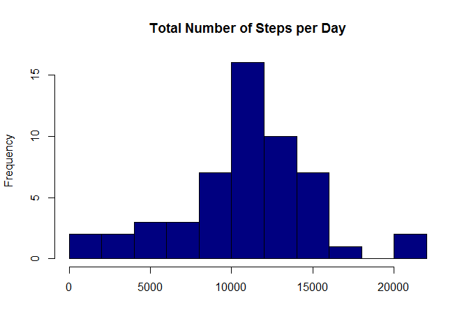
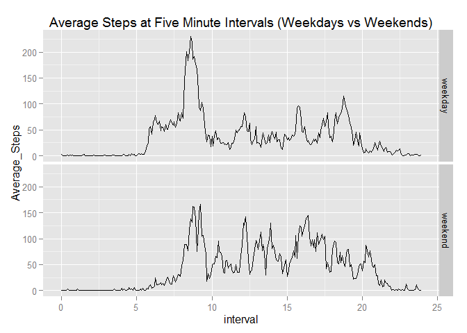

# Reproducible Research-Peer Assessment 1
Mark Jones  
Saturday, May 09, 2015  

## Loading And Preprocessing The Data

We will load the dataset activity.csv using the readr package from the forked repository after manually extracting from zip file.  The date column will be imported as a character field and then converted to POSIXct format using the lubridate package.  We will also convert the data into a data table using the data.table package.


```r
library(readr)
data<-read_csv("activity.csv",col_types="ici")
library(lubridate)
data$date<-mdy(data$date)
library(data.table)
```

```
## 
## Attaching package: 'data.table'
## 
## The following objects are masked from 'package:lubridate':
## 
##     hour, mday, month, quarter, wday, week, yday, year
```

```r
data<-data.table(data)
```

## What Is Mean Total Number Of Steps Taken Per Day?

The number of steps per day will be calculated using the methods provided for a data.table object.  The output is stored in the table totsteps which is then transformed into an xtable object using package xtable.


```r
library(xtable)
totsteps<-data[!is.na(steps),.(Total_Steps=sum(steps)),by=(Day=as.character(date))]
xt.totsteps<-xtable(totsteps)
print(xt.totsteps,type="html",include.rownames=FALSE)
```

<!-- html table generated in R 3.1.3 by xtable 1.7-4 package -->
<!-- Sun May 10 10:29:33 2015 -->
<table border=1>
<tr> <th> Day </th> <th> Total_Steps </th>  </tr>
  <tr> <td> 2012-10-02 </td> <td align="right"> 126 </td> </tr>
  <tr> <td> 2012-10-03 </td> <td align="right"> 11352 </td> </tr>
  <tr> <td> 2012-10-04 </td> <td align="right"> 12116 </td> </tr>
  <tr> <td> 2012-10-05 </td> <td align="right"> 13294 </td> </tr>
  <tr> <td> 2012-10-06 </td> <td align="right"> 15420 </td> </tr>
  <tr> <td> 2012-10-07 </td> <td align="right"> 11015 </td> </tr>
  <tr> <td> 2012-10-09 </td> <td align="right"> 12811 </td> </tr>
  <tr> <td> 2012-10-10 </td> <td align="right"> 9900 </td> </tr>
  <tr> <td> 2012-10-11 </td> <td align="right"> 10304 </td> </tr>
  <tr> <td> 2012-10-12 </td> <td align="right"> 17382 </td> </tr>
  <tr> <td> 2012-10-13 </td> <td align="right"> 12426 </td> </tr>
  <tr> <td> 2012-10-14 </td> <td align="right"> 15098 </td> </tr>
  <tr> <td> 2012-10-15 </td> <td align="right"> 10139 </td> </tr>
  <tr> <td> 2012-10-16 </td> <td align="right"> 15084 </td> </tr>
  <tr> <td> 2012-10-17 </td> <td align="right"> 13452 </td> </tr>
  <tr> <td> 2012-10-18 </td> <td align="right"> 10056 </td> </tr>
  <tr> <td> 2012-10-19 </td> <td align="right"> 11829 </td> </tr>
  <tr> <td> 2012-10-20 </td> <td align="right"> 10395 </td> </tr>
  <tr> <td> 2012-10-21 </td> <td align="right"> 8821 </td> </tr>
  <tr> <td> 2012-10-22 </td> <td align="right"> 13460 </td> </tr>
  <tr> <td> 2012-10-23 </td> <td align="right"> 8918 </td> </tr>
  <tr> <td> 2012-10-24 </td> <td align="right"> 8355 </td> </tr>
  <tr> <td> 2012-10-25 </td> <td align="right"> 2492 </td> </tr>
  <tr> <td> 2012-10-26 </td> <td align="right"> 6778 </td> </tr>
  <tr> <td> 2012-10-27 </td> <td align="right"> 10119 </td> </tr>
  <tr> <td> 2012-10-28 </td> <td align="right"> 11458 </td> </tr>
  <tr> <td> 2012-10-29 </td> <td align="right"> 5018 </td> </tr>
  <tr> <td> 2012-10-30 </td> <td align="right"> 9819 </td> </tr>
  <tr> <td> 2012-10-31 </td> <td align="right"> 15414 </td> </tr>
  <tr> <td> 2012-11-02 </td> <td align="right"> 10600 </td> </tr>
  <tr> <td> 2012-11-03 </td> <td align="right"> 10571 </td> </tr>
  <tr> <td> 2012-11-05 </td> <td align="right"> 10439 </td> </tr>
  <tr> <td> 2012-11-06 </td> <td align="right"> 8334 </td> </tr>
  <tr> <td> 2012-11-07 </td> <td align="right"> 12883 </td> </tr>
  <tr> <td> 2012-11-08 </td> <td align="right"> 3219 </td> </tr>
  <tr> <td> 2012-11-11 </td> <td align="right"> 12608 </td> </tr>
  <tr> <td> 2012-11-12 </td> <td align="right"> 10765 </td> </tr>
  <tr> <td> 2012-11-13 </td> <td align="right"> 7336 </td> </tr>
  <tr> <td> 2012-11-15 </td> <td align="right">  41 </td> </tr>
  <tr> <td> 2012-11-16 </td> <td align="right"> 5441 </td> </tr>
  <tr> <td> 2012-11-17 </td> <td align="right"> 14339 </td> </tr>
  <tr> <td> 2012-11-18 </td> <td align="right"> 15110 </td> </tr>
  <tr> <td> 2012-11-19 </td> <td align="right"> 8841 </td> </tr>
  <tr> <td> 2012-11-20 </td> <td align="right"> 4472 </td> </tr>
  <tr> <td> 2012-11-21 </td> <td align="right"> 12787 </td> </tr>
  <tr> <td> 2012-11-22 </td> <td align="right"> 20427 </td> </tr>
  <tr> <td> 2012-11-23 </td> <td align="right"> 21194 </td> </tr>
  <tr> <td> 2012-11-24 </td> <td align="right"> 14478 </td> </tr>
  <tr> <td> 2012-11-25 </td> <td align="right"> 11834 </td> </tr>
  <tr> <td> 2012-11-26 </td> <td align="right"> 11162 </td> </tr>
  <tr> <td> 2012-11-27 </td> <td align="right"> 13646 </td> </tr>
  <tr> <td> 2012-11-28 </td> <td align="right"> 10183 </td> </tr>
  <tr> <td> 2012-11-29 </td> <td align="right"> 7047 </td> </tr>
   </table>

A histogram of the total number of steps taken per day is then plotted with the base package.


```r
hist(totsteps$Total_Steps,col="navyblue",breaks="FD",main="Total Number of Steps per Day",xlab="")
```

 

The mean and median of the total steps per day are then calculated and then transformed into an xtable object.


```r
totsteps.central<-data.table(cbind(round(mean(totsteps$Total_Steps),0),median(totsteps$Total_Steps)))
setnames(totsteps.central,c("V1","V2"),c("Mean","Median"))
xt.totsteps.central<-xtable(totsteps.central)
print(xt.totsteps.central,type="html",include.rownames=FALSE)
```

<!-- html table generated in R 3.1.3 by xtable 1.7-4 package -->
<!-- Sun May 10 10:29:33 2015 -->
<table border=1>
<tr> <th> Mean </th> <th> Median </th>  </tr>
  <tr> <td align="right"> 10766.00 </td> <td align="right"> 10765.00 </td> </tr>
   </table>

## What Is The Average Daily Activity Pattern?

We will use the data.table methods to calculate average steps per $5$ minute interval across all days and plot the result using the base package.


```r
avgsteps<-data[!is.na(steps),.(Average_Steps=mean(steps)),by=interval]
plot(avgsteps$interval,avgsteps$Average_Steps,type="l",main="Average Steps per 5 Minute Interval",xlab="5 Minute Interval",ylab="Average Steps")
```

 


```r
max.interval=avgsteps[order(-Average_Steps),][1,interval]
```

At least one $5$ minute interval with the maximum number of steps is 835.

## Imputing Missing Values


```r
missing.values<-data[is.na(steps),.N]
```

The number of missing values is 2304. We will use the average number of steps for a given $5$ minute interval as an imputation since we have already calculated that.  We need to be very careful that we have an imputed value for every interval after we do the imputation as it is theoretically possible (but unlikely) that a particular interval has NA for every date in the data.


```r
setkey(data,interval)
setkey(avgsteps,interval)
imp.data<-merge(data,avgsteps)
imp.data[is.na(steps),steps:=as.integer(round(Average_Steps,0))]
missing.values.after<-imp.data[is.na(steps),.N]
```

The number of missing values is after imputation is 0.  We calculate the new sum of steps per day of the imputed data and plot a histogram as before.


```r
imp.totsteps<-imp.data[,.(Total_Steps=sum(steps)),by=(Day=as.character(date))]
hist(imp.totsteps$Total_Steps,col="navyblue",breaks="FD",main="Total Number of Steps per Day of Imputed Data",xlab="")
```

 

Next calculate the mean and median of imputed data.


```r
imp.totsteps.central<-data.table(cbind(round(mean(imp.totsteps$Total_Steps),0),median(imp.totsteps$Total_Steps)))
setnames(imp.totsteps.central,c("V1","V2"),c("Mean","Median"))
xt.imp.totsteps.central<-xtable(imp.totsteps.central)
print(xt.imp.totsteps.central,type="html",include.rownames=FALSE)
```

<!-- html table generated in R 3.1.3 by xtable 1.7-4 package -->
<!-- Sun May 10 10:29:33 2015 -->
<table border=1>
<tr> <th> Mean </th> <th> Median </th>  </tr>
  <tr> <td align="right"> 10766.00 </td> <td align="right"> 10762.00 </td> </tr>
   </table>

```r
prior.mean<-totsteps.central$Mean
prior.median<-totsteps.central$Median
imp.median<-imp.totsteps.central$Median
```


```r
prior.mean<-format(totsteps.central$Mean,scientific=FALSE)
prior.median<-format(totsteps.central$Median,scientific=FALSE)
imp.median<-format(imp.totsteps.central$Median,scientific=FALSE)
```

From the table we see that the mean has stayed the same at 10766, while the median has gone from 10765 to 10762.  The impact on the calculation of total daily steps is that it has shifted the median of the data set down a very small amount.  This makes sense since the mean was slightly less than the median and we imputed with the mean.  If we had chosen to use the median to impute instead then the mean would have shifted up towards the median.  I would consider this an insignificant impact at least on the central tendencies of the data.

## Are There Differences In Activity Patterns Between Weekdays And Weekends?

We will add a new variable to indicate whether a date is a weekday or not and make it a factor.

```r
imp.data$weekday<-weekdays(imp.data$date)
weekdays <- c('Monday', 'Tuesday', 'Wednesday', 'Thursday', 'Friday')
imp.data$weekday<-ifelse(imp.data$weekday %in% weekdays,"weekday","weekend")
imp.data$weekday<-factor(imp.data$weekday)
```

Now we will take averages by interval and by whether or not it is a weekend or a weekday.


```r
wkday.avgsteps<-imp.data[,.(Average_Steps=mean(steps)),by=c("interval","weekday")]
library(ggplot2)
g<-ggplot(wkday.avgsteps,aes(x=interval,y=Average_Steps))+
    geom_line()+
    facet_grid(weekday~.)
g
```

 

So there does seem to be a difference between weekends and weekdays in that on weekends people walk less during the early morning and late afternoon than on weekends when people would be traveling to and from work.  They also walk more throughout the day on weekends as opposed to weekdays when people would be more stationary sitting at their desks.


